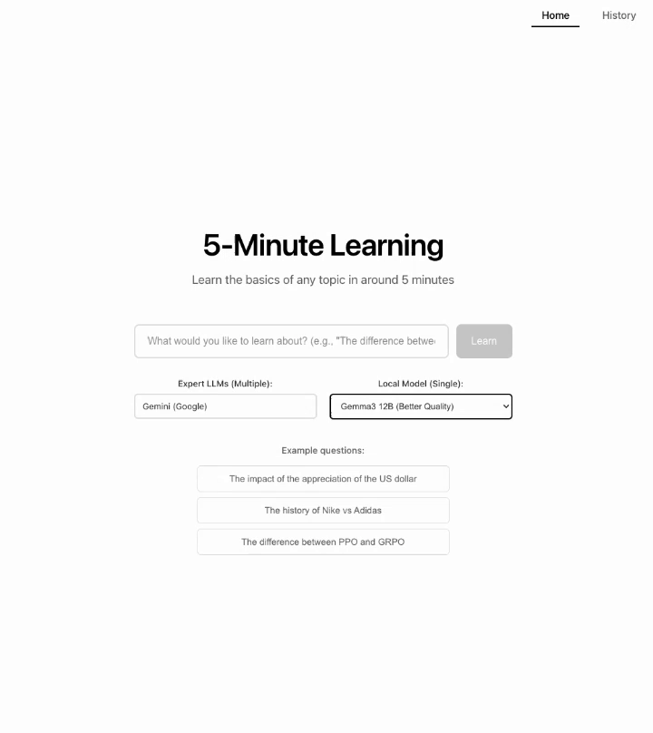

# 5-Minute Learning App

Tired of LLMs hallucinating or over-explaining simple concepts—like using 1500 words to justify why 8.11 is greater than 8.9?
Meet your solution: a powerful web app that delivers concise, accurate overviews of any topic to understand in just 5 minutes, powered by intelligent multi-LLM summarization and comparison.

## 🌟 Core Features

### 1. **5-Minute Learning Experience**
Ask any question and get a comprehensive, digestible summary in about 5 minutes. Perfect for quick learning sessions on topics like:
- "The difference between PPO and GRPO"
- "The impact of the appreciation of the US dollar"
- "The history of Nike vs Adidas"

### 2. **Multi-LLM Summarization**
- **Expert Consultation**: Queries multiple LLM providers (ChatGPT, Claude, Gemini) simultaneously
- **Intelligent Summarization**: Uses local Ollama models to compare and synthesize responses and save cost
- **Consensus Highlighting**: Identifies consistent information across sources and points out differences
- **Source Transparency**: Shows which models contributed to each answer

### 3. **AI-Powered Development with Cline**
This project showcases modern AI-assisted development practices:
- Built using Claude's Cline for intelligent code generation
- Comprehensive test coverage with both unit and integration tests
- Automated database management and visualization tools

## 🎬 Demo



## 🚀 Installation

### Prerequisites
- Python 3.8+
- Node.js 16+
- PostgreSQL 12+
- [Ollama](https://ollama.ai/) (for local LLM)

### 1. Clone the Repository
```bash
git clone https://github.com/yourusername/5mins-learning-app.git
cd 5mins-learning-app
```

### 2. Backend Setup

#### Install Python Dependencies
```bash
# Create virtual environment (recommended)
python -m venv venv
source venv/bin/activate

# Install dependencies
pip install -r requirements.txt
```

#### Database Setup
```bash
# Create PostgreSQL database
createdb 5mins_learning

# Set up database schema and test data
./db/reset_db.sh
```

#### Environment Configuration
```bash
# Copy environment template
cp .env.example .env.local

# Edit .env.local with your settings
```

Required environment variables:
```env
# Database
DATABASE_URL=postgresql+asyncpg://username@localhost:5432/5mins_learning

# Optional API Keys (leave empty to disable specific providers)
OPENAI_API_KEY=your_openai_key_here
ANTHROPIC_API_KEY=your_anthropic_key_here
GEMINI_API_KEY=your_gemini_key_here
```

#### Install and Configure Ollama
```bash
# Install Ollama from https://ollama.ai/
brew install ollama

# Pull required models
ollama pull gemma3:4b
ollama pull gemma3:12b

# Verify Ollama is running
curl http://localhost:11434/api/tags
```

### 3. Frontend Setup
```bash
cd frontend
npm install
```

## 🎯 Usage

### Starting the Application

#### 1. Start Backend Server
```bash
# From project root
uvicorn app.main:app --reload
```
Backend runs on: `http://localhost:8000`
API documentation: `http://localhost:8000/docs`

#### 2. Start Frontend Development Server
```bash
# From frontend directory
cd frontend
npm start
```
Frontend runs on: `http://localhost:3000`

### Using the Application

#### **Home Page**
- Enter your learning question in the central input box
- Select expert LLM providers (ChatGPT, Claude, Gemini)
- Choose your local summarization model (gemma3:4b or gemma3:12b)
- Click submit to start your 5-minute learning session

#### **Conversation Page**
- View real-time responses as they stream in
- See which models contributed to each response
- Toggle visibility of the AI's thinking process
- Ask follow-up questions with model reselection
- Use "Retry" to regenerate responses with different models

#### **History Page**
- Browse all previous conversations
- Quick access to continue past discussions
- Delete conversations you no longer need

## 🛠️ Development

### Database Tools
```bash
# Reset entire database
./db/reset_db.sh

# View database contents
python -m db.visualize_db

# View specific conversation
python -m db.visualize_db --conversation [ID]

# View specific message
python -m db.visualize_db --message [ID]
```

### Testing
```bash
# Run unit tests
pytest app/tests/mock_tests/

# Run integration tests (requires running server)
python -m app.tests.real_tests.test_live_server
```

### Key API Endpoints
- `POST /api/conversations` - Create new conversation
- `POST /api/conversations/{id}/first-reply` - Generate initial response
- `POST /api/conversations/{id}/reply` - Continue conversation
- `GET /api/conversations/{id}/messages` - Load conversation history

## 🔧 Configuration

### LLM Provider Configuration
The app supports flexible LLM provider configuration:

- **Multi-provider queries**: Select any combination of ChatGPT, Claude, and Gemini
- **Local summarization**: Choose between gemma3:4b (faster) or gemma3:12b (more capable)
- **Graceful degradation**: App works with any available providers

### Model Options
- **OpenAI**: gpt-4o-mini (default)
- **Anthropic**: claude-3-haiku-20240307 (default)
- **Google**: gemini-2.0-flash (default)
- **Ollama**: gemma3:4b, gemma3:12b, deepseek-r1:8b

## 🤝 Contributing

Welcome any kind of contribution.

## License

[](https://creativecommons.org/licenses/by-nc/4.0/)
---

**Made with ❤️ for curious minds who value efficient learning and AI coding**
